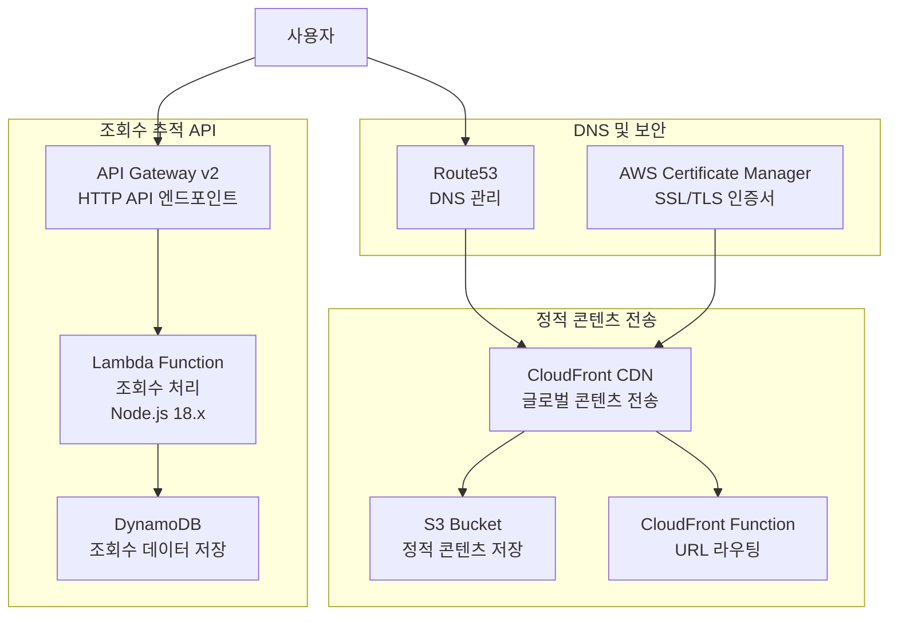

# 개인 블로그 인프라스트럭처

AWS 기반 서버리스 블로그 호스팅 인프라스트럭처를 위한 Terraform 프로젝트입니다.

## 프로젝트 개요

이 프로젝트는 AWS 클라우드 서비스를 활용하여 정적 블로그 웹사이트를 호스팅하는 완전한 서버리스 인프라스트럭처를 제공합니다. Terraform을 사용하여 Infrastructure as Code(IaC) 방식으로 관리되며, 확장 가능하고 비용 효율적인 블로그 플랫폼을 구축합니다.

블로그는 `blog.hrsong.com` 도메인에서 서비스되며, 정적 콘텐츠 배포와 동적 조회수 추적 기능을 모두 지원합니다. 전 세계 사용자에게 빠른 콘텐츠 전송을 위해 CloudFront CDN을 활용하고, 서버리스 아키텍처를 통해 운영 비용을 최소화합니다.

## 주요 기능

### 🌐 정적 웹사이트 호스팅

- **S3 기반 정적 콘텐츠 저장**: 블로그 파일들을 안전하게 저장하고 관리
- **CloudFront CDN**: 전 세계 엣지 로케이션을 통한 빠른 콘텐츠 전송
- **커스텀 도메인 지원**: `blog.hrsong.com`을 통한 브랜드 일관성 유지
- **SSL/TLS 인증서**: HTTPS를 통한 보안 연결 제공

### 📊 조회수 추적 시스템

- **서버리스 API**: Lambda 함수를 통한 실시간 조회수 처리
- **DynamoDB 저장소**: 확장 가능한 NoSQL 데이터베이스로 조회수 데이터 관리
- **CORS 지원**: 크로스 오리진 요청을 통한 안전한 API 호출
- **API Gateway 통합**: RESTful API 엔드포인트 제공

### 🔧 인프라스트럭처 관리

- **Infrastructure as Code**: Terraform을 통한 선언적 인프라 관리
- **버전 관리**: 인프라 변경사항의 추적 및 롤백 지원
- **자동화된 배포**: 일관된 환경 구성 및 배포 프로세스
- **보안 모범 사례**: IAM 역할 기반 접근 제어 및 최소 권한 원칙 적용

### 🚀 성능 최적화

- **글로벌 CDN**: CloudFront를 통한 전 세계 캐싱 및 가속화
- **캐시 정책 최적화**: 정적 자산과 동적 콘텐츠에 대한 맞춤형 캐싱 전략
- **압축 및 최적화**: 자동 Gzip 압축을 통한 전송 속도 향상
- **SSG 지원**: CloudFront 함수를 통한 SSG 애플리케이션 라우팅

## 아키텍처

### 아키텍처 다이어그램



### 인프라스트럭처 구성 요소

#### 🌐 정적 콘텐츠 전송 계층

**Amazon S3 (Simple Storage Service)**

- **역할**: 정적 웹사이트 파일 저장 및 호스팅
- **구성**:
  - Origin Access Control (OAC)을 통한 보안 접근 제어
  - CloudFront 전용 접근으로 직접 S3 접근 차단
  - 퍼블릭 액세스 완전 차단으로 보안 강화
- **파일 유형**: HTML, CSS, JavaScript, 이미지, 폰트 등 모든 정적 자산

**Amazon CloudFront**

- **역할**: 글로벌 콘텐츠 전송 네트워크 (CDN)
- **구성**:
  - 커스텀 캐시 정책으로 최적화된 캐싱 (기본 TTL: 1시간)
  - Origin Shield 활성화로 오리진 부하 감소
  - HTTPS 리다이렉션으로 보안 연결 강제
  - 403 에러를 404.html로 리다이렉션하여 SSG 지원
- **성능**: PriceClass_200으로 아시아-태평양 및 북미 엣지 로케이션 활용

**CloudFront Function**

- **역할**: URL 라우팅 및 요청 처리
- **기능**:
  - 파일 확장자가 없는 경로를 `/index.html`로 리라이팅
  - SSG(Static Site Generator) 애플리케이션 지원
  - 뷰어 요청 단계에서 실행되어 빠른 응답 제공

#### 📊 조회수 추적 API 계층

**Amazon API Gateway v2 (HTTP API)**

- **역할**: RESTful API 엔드포인트 제공
- **구성**:
  - CORS 설정으로 `blog.hrsong.com` 및 로컬 개발 환경 지원
  - GET, POST, OPTIONS 메서드 지원
  - Lambda 프록시 통합으로 요청 전달
- **보안**: API 토큰 기반 인증으로 무단 접근 방지

**AWS Lambda**

- **역할**: 서버리스 조회수 처리 로직
- **런타임**: Node.js 18.x
- **기능**:
  - GET 요청: 특정 페이지의 조회수 조회
  - POST 요청: 조회수 증가 및 업데이트
  - OPTIONS 요청: CORS 프리플라이트 처리
- **보안**: 환경 변수를 통한 API 시크릿 관리
- **성능**: 3초 타임아웃으로 빠른 응답 보장

**Amazon DynamoDB**

- **역할**: 조회수 데이터 저장소
- **구성**:
  - Pay-per-request 빌링 모드로 비용 최적화
  - `slug` 필드를 파티션 키로 사용
  - 원자적 증가 연산으로 동시성 처리
- **확장성**: 서버리스 NoSQL로 자동 확장

#### 🔒 DNS 및 보안 계층

**Amazon Route53**

- **역할**: DNS 관리 및 도메인 라우팅
- **구성**:
  - `blog.hrsong.com` A 레코드를 CloudFront 배포로 연결
  - 별칭 레코드를 통한 효율적인 DNS 해석
  - 기존 호스팅 존 활용

**AWS Certificate Manager (ACM)**

- **역할**: SSL/TLS 인증서 관리
- **구성**:
  - us-east-1 리전의 인증서 (CloudFront 요구사항)
  - SNI(Server Name Indication) 지원
  - TLS 1.2 이상 프로토콜 강제

### 데이터 플로우

#### 정적 콘텐츠 전송 플로우

1. **사용자 요청**: 브라우저에서 `blog.hrsong.com/article-name` 접근
2. **DNS 해석**: Route53이 CloudFront 배포 도메인으로 라우팅
3. **SSL 터미네이션**: ACM 인증서를 통한 HTTPS 연결 설정
4. **CloudFront 처리**:
   - 엣지 로케이션에서 캐시 확인
   - CloudFront Function이 URL을 `/article-name/index.html`로 리라이팅
5. **오리진 요청**: 캐시 미스 시 S3에서 콘텐츠 조회 (OAC 인증)
6. **응답 전송**: 압축된 콘텐츠를 사용자에게 전송 및 엣지에 캐싱

#### 조회수 추적 플로우

1. **API 호출**: 웹페이지 JavaScript에서 조회수 API 호출
2. **CORS 처리**: API Gateway에서 오리진 검증 및 CORS 헤더 설정
3. **Lambda 실행**:
   - API 토큰 검증으로 인증 확인
   - 요청 메서드에 따른 분기 처리
4. **DynamoDB 연산**:
   - GET: 현재 조회수 조회
   - POST: 원자적 증가 연산으로 조회수 업데이트
5. **응답 반환**: JSON 형태로 조회수 데이터 반환
6. **웹페이지 업데이트**: JavaScript가 응답을 받아 UI 업데이트

#### 보안 및 접근 제어

- **S3 보안**: OAC를 통해 CloudFront만 접근 허용, 퍼블릭 액세스 완전 차단
- **API 보안**: 커스텀 API 토큰을 통한 인증, CORS로 허용된 오리진만 접근
- **전송 보안**: 모든 통신이 HTTPS로 암호화, HTTP는 HTTPS로 리다이렉션
- **IAM 보안**: 최소 권한 원칙에 따른 역할 기반 접근 제어

## 사전 요구사항

### 필수 도구 및 버전

이 프로젝트를 배포하고 관리하기 위해서는 다음 도구들이 설치되어 있어야 합니다:

#### Terraform

- **최소 버전**: 1.2.0 이상
- **권장 버전**: 1.5.0 이상
- **설치 확인**:
  ```bash
  terraform version
  ```
- **설치 방법**: [Terraform 공식 설치 가이드](https://developer.hashicorp.com/terraform/downloads)

#### AWS CLI

- **최소 버전**: 2.0 이상
- **설치 확인**:
  ```bash
  aws --version
  ```
- **설치 방법**: [AWS CLI 설치 가이드](https://docs.aws.amazon.com/cli/latest/userguide/getting-started-install.html)

### AWS 계정 및 권한 설정

#### AWS 프로필 구성

1. **AWS 자격 증명 설정**:
   ```bash
   aws configure --profile your-profile-name
   ```
2. **필요한 정보 입력**:

   - AWS Access Key ID
   - AWS Secret Access Key
   - Default region: `ap-northeast-2`
   - Default output format: `json`

3. **프로필 확인**:
   ```bash
   aws sts get-caller-identity --profile your-profile-name
   ```

#### IAM 역할 설정

이 인프라스트럭처는 역할 가정(Role Assumption) 방식을 사용합니다:

1. **Terraform 실행 역할**:

   - 역할 이름: `terraform-execution-role` (또는 사용자 정의)
   - 필요 권한:
     - S3 버킷 생성 및 관리
     - CloudFront 배포 생성 및 관리
     - Lambda 함수 생성 및 관리
     - API Gateway 생성 및 관리
     - DynamoDB 테이블 생성 및 관리
     - Route53 레코드 관리
     - IAM 역할 및 정책 관리

2. **Lambda 실행 역할**:

   - 역할 이름: `lambda-execution-role` (또는 사용자 정의)
   - 필요 권한:
     - DynamoDB 읽기/쓰기 권한
     - CloudWatch Logs 쓰기 권한

3. **역할 신뢰 관계 설정**:
   ```json
   {
     "Version": "2012-10-17",
     "Statement": [
       {
         "Effect": "Allow",
         "Principal": {
           "AWS": "arn:aws:iam::YOUR-ACCOUNT-ID:user/YOUR-USERNAME"
         },
         "Action": "sts:AssumeRole"
       }
     ]
   }
   ```

### 환경 설정 체크리스트

배포를 시작하기 전에 다음 항목들을 확인하세요:

#### ✅ 도구 설치 확인

- [ ] Terraform 1.2.0 이상 설치됨
- [ ] AWS CLI 2.0 이상 설치됨
- [ ] Git 설치됨 (코드 관리용)

#### ✅ AWS 계정 설정 확인

- [ ] AWS 계정 생성 및 활성화
- [ ] AWS CLI 프로필 구성 완료
- [ ] IAM 사용자 또는 역할 생성
- [ ] 필요한 권한 정책 연결
- [ ] 역할 가정 권한 설정 (해당하는 경우)

#### ✅ 도메인 및 인증서 준비

- [ ] 사용할 도메인 준비 (예: `yourdomain.com`)
- [ ] Route53 호스팅 존 생성 또는 확인
- [ ] ACM에서 SSL 인증서 발급 (us-east-1 리전)
- [ ] 인증서 검증 완료

#### ✅ 프로젝트 설정 확인

- [ ] 프로젝트 저장소 클론
- [ ] `terraform.tfvars` 파일 생성 준비
- [ ] API 시크릿 키 생성 (조회수 API용)
- [ ] 백엔드 상태 저장소 설정 (선택사항)

### 개발 환경 설정

#### 로컬 개발을 위한 추가 도구

```bash
# Terraform 포맷팅 및 검증
terraform fmt
terraform validate

# AWS 리소스 상태 확인
aws sts get-caller-identity
aws s3 ls

# Lambda 함수 패키징 (필요시)
cd lambda
zip -r ../lambda.zip .
cd ..
```

#### 환경 변수 설정 (선택사항)

```bash
# AWS 프로필 설정
export AWS_PROFILE=your-profile-name

# Terraform 백엔드 설정
export TF_VAR_backend_bucket=your-terraform-state-bucket
export TF_VAR_backend_key=terraform.tfstate
```
